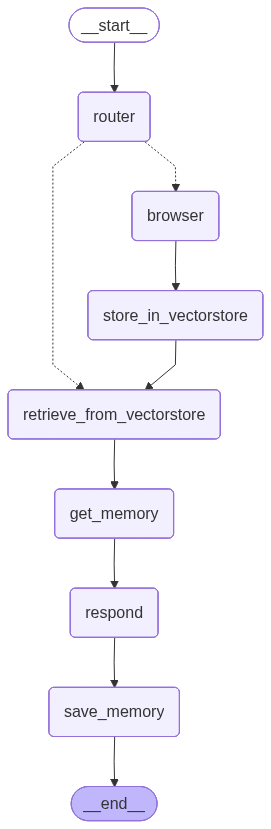

## 🤖 Naviria: A Telegram AI Agent Powered by LangGraph, RAG, and MCP

<p align="left">
  
  
  
  
  
  
  
  
</p>


Naviria is a conversational AI agent deployed on Telegram I’m building to learn—and showcase—the core technologies behind modern AI agents. It combines LLM-driven reasoning, the [Model Context Protocol (MCP)][mcp] for pluggable tools, and [Retrieval-Augmented Generation (RAG)][rag] with embeddings and a vector store. Beyond simple Q&A, Naviria integrates a modular architecture and a selection of AI Agent's resources:

- 🧩 **Advanced agentic logic:** Built on [LangGraph][langgraph], Naviria runs as a state machine, intelligently routing user requests across tools and knowledge sources.
- 🔎 **Retrieval-Augmented Generation (RAG):** A self-updating knowledge base powered by a [FAISS][faiss] vector store and Google’s high-performance [EmbeddingGemma][embedder] model for document embeddings.
- 🛰️ **Model Context Protocol (MCP):** Seamlessly connects to external tools like [Tavily Search][tavily] to fetch fresh web data and enrich the knowledge base in real time.
- 🧠 **Personalized long-term memory:** Maintains persistent [memory][memory] per user for contextual, personalized conversations.
- 🔀 **Flexible LLM integration:** Works with multiple models—OpenAI (e.g., [gpt-5-nano][gpt5nano], [gpt-4.1-nano][gpt41nano], [gpt-4o-mini][gpt4omini]) and open-source via Ollama (e.g., [llama3.1:8b][llama], [gpt-oss:20b][gtposs]).

<p align="center">
  <video
    src="https://github.com/user-attachments/assets/e19945b5-1a25-4e85-9b7f-0dbcef9cbb9a"
    controls
    muted
    playsinline
    loop
    width="720">
  </video>
</p>


---

### 🧭 Core Architecture

Naviria's logic is built as a stateful, cyclic graph using LangGraph. This allows for a robust and debuggable flow where each step is a distinct node. The agent follows this distinct sequence, visualized below, to process every user request.



This flow consists of the following key steps:

1.  **🚦 Intelligent Routing** (`router_node`): The process begins with a router powered by [`gpt-5-nano`][gpt5nano] and a structured Pydantic model (`Route`). It analyzes the user's message against the `ROUTER_PROMPT` to decide the optimal path: `browser` for real-time queries or `retrieve_from_vectorstore` for general knowledge.

2.  **🌐 Dynamic Knowledge Acquisition** (The `browser` Loop): This two-step process allows Naviria to learn from the web.
    *   **Web Search** (`browser_node`): If real-time information is needed, this node connects to the Tavily Search API using a dedicated `MCP Client` to perform a targeted search.
    *   **Knowledge Ingestion** (`store_in_vectorstore_node`): Search results are converted into `Document` objects, embedded with Google's [`embedding-gemma-300m`][embedder] model, and indexed into the `FAISS` vector store. This allows Naviria to learn and instantly recall new information.

3.  **📚 Vector Retrieval** (`retrieve_best_documents_node`): For every query, the agent performs a similarity search on its [`FAISS`][faiss] vector store, which is configured with a `MAX_INNER_PRODUCT` strategy. The top two most relevant document chunks are retrieved, filtering out any below a set relevance threshold to ensure only high-quality context is used.

4.  **🧠 Context-Aware Generation** (`respond_node`): The final response is generated by synthesizing multiple sources of information. The `LLM_PROMPT` is dynamically populated with the user's long-term memory, the retrieved documents, and the current chat history. This rich context is fed to the primary LLM to produce a grounded, accurate, and personalized answer.

5.  **💾 Memory Persistence** (`save_memory_node`): After responding, the agent reflects on the latest interaction. It uses the `CREATE_MEMORY_PROMPT` to identify and summarize new personal information. This summary then updates the user's long-term memory, ensuring Naviria remembers and grows with each conversation.

---

### 🔑 APIs required

- 💬 **TELEGRAM:** Used to deploy the assistant on Telegram. You can obtain one by creating a new bot using ['@BotFather'][botfather]. Simply start a chat, send the /newbot command, and follow the on-screen instructions. Copy the token it provides.

- 🔎 **TAVILY:** For web search. The Research plan offers **1,000** free credits per month. Get your key at [Tavily][tavily_api].
- 🧠 **OPENAI:** Runs the LLMs. (I allocated $5 for this project; current spend ~$0.64.) Create an API key at [OpenAI][openai_api].  
  Models in this project were selected for a good price/performance balance (prices as of **09/08/2025**):
  - **[gpt-5-nano][gpt5nano]** — Input/Output price: $0.05 / $0.40
  - **[gpt-4.1-nano][gpt41nano]** — Input/Output price: $0.10 / $0.40
  - **[gpt-4o-mini][gpt4omini]** — Input/Output price: $0.15 / $0.60

---
### 🚀 Setup & Installation

I highly recommend using **['uv'][uv]** as your Python package & project manager. It installs packages and creates virtual environments **much faster** than traditional `pip` workflows. 

**1. Creates your Telegram bot:** Before you can run the application, you need to create a bot on Telegram. Open a chat with ['@BotFather'][botfather], send the /newbot command, and follow the instructions. 

Once you complete the process, BotFather will provide you with a unique API token. Copy this token, as you will need it for the configuration step.

**2. Clone the Repository:** Clone the project repository to your local machine and navigate into the directory.
```bash
git clone https://github.com/your-username/naviria.git
cd naviria
```
**3. Create and Activate a Virtual Environment:** It is highly recommended to use a virtual environment to manage dependencies.

Using uv (Recommended):

```bash
uv venv
source .venv/bin/activate  # On Windows, use: .venv\Scripts\activate
```
Using Python's built-in `venv`:
```bash
python -m venv .venv
source .venv/bin/activate  # On Windows, use: .venv\Scripts\activate
```
**4. Configure Your API Keys:** You'll need to provide your API keys for the services Naviria uses.

- Create the '.env' file: Create a '.env' file in the root directory.

- Edit the .env file: Open the newly created '.env' file and add your secret keys:
```code
TELEGRAM_TOKEN="your-telegram-bot-token"
OPENAI_API_KEY="your-openai-api-key"
```
- Configure the 'tavily.json' file: Open the 'tavily.json' file and insert your Tavily API key in the designated field. This is required for the MCP client to connect properly.

**5. Install Dependencies:** Install all the required Python packages using your preferred tool.

Using uv (Recommended):

```bash
uv pip install -r requirements.txt
```
Using pip:
```bash
pip install -r requirements.txt
```
**6. Run the Application:** You can now start the Naviria assistant from your virtual environment automatically.

Using uv (Recommended): 
```bash
uv run main.py
```
Using standard python: 
```bash
python main.py
```

## 📂 Repository Structure

The project is organized into several key files, each with a specific objective:


```text
📁 naviria/
├── 📄 .gitignore          # Specifies which files and directories should be ignored by Git.
├── 🤖 agent.py            # Core logic of the agent, including the LangGraph state machine.
├── 🚀 main.py             # Main entry point that initializes and runs the Telegram bot.
├── 🔌 mcp_clients.py      # Manages MCP connections to external tools like Tavily.
├── 📊 naviria_graph.png   # Visual representation of the agent's state flow for documentation.
├── 📝 prompts.py          # Centralized module for all LLM prompts (routing, generation, memory).
├── 📋 requirements.txt    # Lists all Python dependencies required to run the project.
├── ⚙️ tavily.json         # Configuration file for the Tavily MCP client.
└── 💬 telegram_bot.py     # Defines Telegram bot command handlers and message response logic.
```
#
✍️ Author: Antonio Castañares Rodríguez

📌 This repository documents a key project in my AI learning path, focused on gaining a deep, practical understanding of agentic systems by building one from its core components.

[mcp]: https://modelcontextprotocol.io/docs/getting-started/intro
[rag]: https://arxiv.org/pdf/2005.11401
[langgraph]: https://python.langchain.com/docs/introduction/
[faiss]: https://python.langchain.com/docs/integrations/vectorstores/faiss/
[embedder]: https://huggingface.co/blog/embeddinggemma
[tavily]: https://docs.tavily.com/documentation/mcp
[memory]: https://langchain-ai.github.io/langgraph/how-tos/memory/add-memory/
[gpt5nano]: https://platform.openai.com/docs/models/gpt-5-nano
[gpt41nano]: https://platform.openai.com/docs/models/gpt-4.1-nano
[gpt4omini]: https://platform.openai.com/docs/models/gpt-4o-mini
[llama]: https://ollama.com/library/llama3.1
[gtposs]: https://ollama.com/library/gpt-oss
[botfather]: https://telegram.me/BotFather
[tavily_api]: https://app.tavily.com/home
[openai_api]: https://platform.openai.com/api-keys
[uv]: https://docs.astral.sh/uv/
